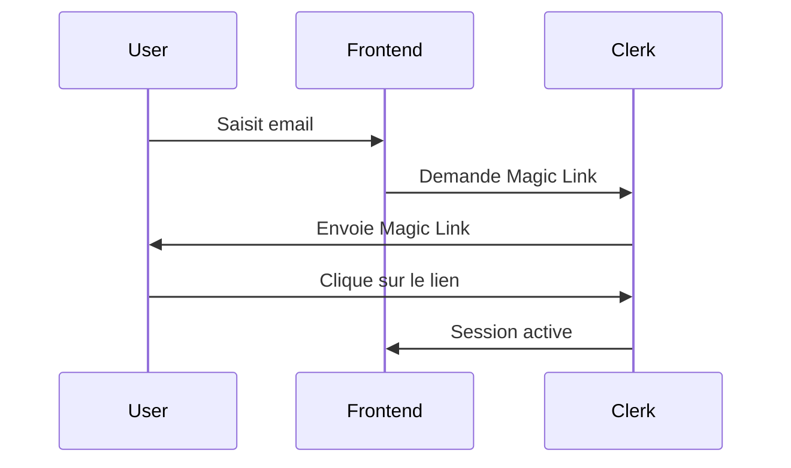

# Cahier des Charges - Plateforme de Réservation de Coworking

## Contexte et Objectifs

### **Contexte**
Le client souhaite disposer d'une plateforme de réservation en ligne sécurisée pour des espaces de coworking. La solution doit permettre aux utilisateurs de découvrir, réserver et gérer leurs réservations d'espaces de travail partagés de manière intuitive et sécurisée.

### **Objectifs Principaux**
- Fournir une plateforme web moderne et responsive
- Garantir une sécurité maximale des données utilisateurs
- Offrir une expérience utilisateur fluide et intuitive
- Permettre une gestion administrative complète
- Assurer une scalabilité et maintenabilité du code

### **Public Cible**
- **Utilisateurs finaux** : Freelancers, entrepreneurs, télétravailleurs
- **Administrateurs** : Gestionnaires des espaces de coworking
- **Propriétaires** : Propriétaires des espaces

---

## Fonctionnalités

### ** Authentification et Gestion des Utilisateurs**

#### Inscription/Connexion
-  **Magic Link** : Authentification sans mot de passe via email
-  **Clerk Integration** : Gestion complète des tokens et sessions
-  **Vérification Email** : Confirmation obligatoire de l'adresse email
-  **Profils Utilisateurs** : Gestion des informations personnelles
-  **Suppression de Compte** : Possibilité de supprimer définitivement son compte

#### Rôles et Permissions
- **USER** : Utilisateur standard (réservation d'espaces)
- **ADMIN** : Administrateur (gestion complète de la plateforme)

### ** Gestion des Espaces**

#### Pour les Utilisateurs
-  **Consultation** : Parcourir les espaces disponibles
-  **Réservation** : Réserver un espace pour une période donnée
-  **Détails** : Voir les détails complets d'un espace
-  **Galerie** : Visualiser les photos des espaces
-  **Disponibilités** : Consulter les créneaux disponibles

#### Pour les Administrateurs
-  **Création** : Ajouter de nouveaux espaces
-  **Modification** : Éditer les informations des espaces
-  **Suppression** : Supprimer des espaces
-  **Statistiques** : Tableau de bord avec métriques

### ** Système de Réservations**

#### Fonctionnalités de Réservation
-  **Réservation par Créneaux** : Sélection d'heures de début/fin
-  **Calcul Automatique** : Prix calculé selon la durée
-  **Gestion des Conflits** : Éviter les doubles réservations
-  **Notifications Email** : Confirmations et rappels

#### Gestion des Réservations
-  **Historique** : Consultation des réservations passées
-  **Modification** : Changer les dates/heures (si possible)
-  **Annulation** : Annuler une réservation
-  **Statuts** : Suivi des états (confirmée, annulée, terminée)

### ** Administration**

#### Dashboard Administrateur
-  **Statistiques Globales** :
  - Nombre total d'utilisateurs
  - Nombre d'espaces disponibles
  - Nombre de réservations
  - Revenus générés
-  **Gestion des Espaces** : CRUD complet

---

##  Architecture Technique

### **Stack Technologique**

#### Frontend
- **Framework** : Next.js 16 (App Router)
- **Langage** : TypeScript
- **Styling** : Tailwind CSS
- **UI Components** : Components custom + Headless UI
- **État Global** : React Context + useState/useEffect
- **Validation** : React Hook Form + Zod

#### Backend
- **Runtime** : Node.js
- **Framework** : Next.js API Routes
- **ORM** : Prisma
- **Base de Données** : PostgreSQL
- **Authentification** : Clerk
- **Emails** : Resend

#### Services Externes
- **Authentification** : Clerk (Magic Link, JWT, Session Management)
- **Email** : Resend (Transactional emails)

### **Architecture des Dossiers**

```
src/
├── app/                   # App Router (Next.js 14+)
│   ├── login/             # Route authentification
│   ├── register/          # Routes d'inscription
│   ├── admin/             # Interface administrateur
│   ├── api/               # API Routes
│   └── spaces/            # Gestion des espaces
│   └── reservations/      # Gestion des réservations 
├── components/            # Composants React réutilisables
├── controller/            # Logique métier (business logic)
├── model/                 # Modèles de données (Prisma)
├── serverAction/          # Server Actions (Next.js)
├── lib/                   # Utilitaires et configuration
├── types/                 # Types TypeScript
└── middleware.ts          # Middleware d'authentification
```

---

## 🔒 Sécurité

### **Authentification et Autorisation**

#### Clerk Integration
- **JWT Tokens** : Gestion automatique des tokens par Clerk
- **Session Management** : Sessions sécurisées côté serveur
- **Magic Link** : Authentification sans mot de passe
- **Token Refresh** : Renouvellement automatique des tokens

#### Middleware de Sécurité
```typescript
// Protection des routes sensibles
export default clerkMiddleware(async (auth, req) => {
  // If the route is public, allow access without authentication
  if (isPublicRoute(req)) {
    return;
  }

  // For protected routes, check authentication
  const { userId } = await auth();
  
  // If the user is not authenticated, redirect to unauthorized page
  if (!userId) {
    return NextResponse.redirect(new URL('/unauthorized', req.url));
  }

  // For admin routes, additional checks can be added here if needed
  if (isAdminRoute(req)) {
    // Additional admin validation could be added here
    // For now, i let the page component handle admin role verification
  }
  
  // If authenticated, allow access
  return;
});
```

#### Protection des API Routes
-  **Authentification requise** pour toutes les opérations sensibles
-  **Validation des rôles** (USER/ADMIN)
-  **Validation des données** avec Zod
-  **Rate Limiting** (limitation des requêtes)

### **Sécurité des Données**

#### Base de Données
- **Chiffrement** : Données sensibles chiffrées
- **Pas de mots de passe** : Gestion déléguée à Clerk
- **Validation** : Contraintes de base de données

#### Validation des Entrées
- **Côté Client** : Validation React Hook Form + Zod
- **Côté Serveur** : Double validation avec Prisma + Zod
- **SQL Injection** : Protection via Prisma ORM

### **Protection CSRF et XSS**
- **CSRF Tokens** : Protection contre les attaques CSRF
- **Content Security Policy** : Headers de sécurité

---

## Authentification

### **Flux d'Authentification avec Clerk**

#### 2. Connexion



### **Gestion des Sessions**
- **Durée** : Sessions longue durée (30 jours)
- **Renouvellement** : Automatique via Clerk
- **Révocation** : Possibilité de déconnexion globale
- **Multi-device** : Support des sessions multiples

### **Protection des Routes**
// Route protégée
redirect : /forbidden, /not-found, /unauthorized, /error

---

## Gestion des Emails

### **Service Email : Resend**

#### Configuration
- **Domaine vérifié** : Envoi depuis domaine custom
- **Templates** : Templates HTML

#### Types d'Emails Envoyés

##### 1. **Emails d'Authentification** (via Clerk)
- Magic Link d'inscription
- Magic Link de connexion
- Vérification d'email

##### 2. **Emails de Réservation**
```typescript
// Email de confirmation de réservation
export async function sendSuccessReservationEmail(user: User) {
  await resend.emails.send({
    from: "Coworking <onboarding@resend.dev>",
    to: user.email,
    subject: "Confirmation de réservation",
    html: `<p>Bonjour ${user.firstname || ''}, votre réservation est confirmée.</p> <br> <p> Nous vous remercions pour votre confiance.</p> <br> <p>À bientôt !</p>`,
  });
}
```

-  **Confirmation de réservation**
-  **Modification de réservation**
-  **Annulation de réservation**
-  **Rappels 24h avant**

### **Déclenchement des Emails**

#### Moments d'Envoi
1. **Après création de réservation** → Email de confirmation
2. **Après modification** → Email de mise à jour
3. **Après annulation** → Email d'annulation
4. **24h avant réservation** → Email de rappel
5. **Suppression de compte** → Email de confirmation

#### Implementation
```typescript
// Envoi automatique via Server Actions
export async function createReservationAction(formData: { spaceId: string; start: string; end: string }) {
  try {
    const spaceId = formData.spaceId;
    const start = new Date(formData.start);
    const end = new Date(formData.end);

    const result = await createReservationController(spaceId, start, end);

    await sendSuccessReservationEmail(result.user); // Send success email
    
    // Revalidate relevant paths
    revalidatePath("/reservations");
    revalidatePath(`/spaces/${spaceId}/availabilities`);
    
    return result;
  } catch (error) {
    handleServerActionError(error);
  }
}
```

---

## États Applicatifs

### **Gestion des États Frontend**

#### 1. **États de Chargement**
```typescript
const [isLoading, setIsLoading] = useState(false);
const [error, setError] = useState<string | null>(null);
const [data, setData] = useState<T[] | null>(null);
```

#### 2. **États Globaux**
- **Loading States** : Spinners et skeletons
- **Error States** : Messages d'erreur contextuels
- **Success States** : Confirmations d'actions
- **Empty States** : Message pour données vides

### **États par Fonctionnalité**

#### Espaces
- ** Liste d'espaces** : Loading, Données, Vide, Erreur
- ** Détail d'espace** : Loading, Trouvé, Non trouvé
- ** Disponibilités** : Loading, Créneaux existant, Créneau expiré, Créneau indisponible

#### Réservations
- ** Création** : Action, Validation, Envoi, Succès, Erreur
- ** Liste** : Loading, Données, Vide (aucune réservation)
- ** Modification** : Action, Envoi, Succès, Erreur

#### Authentification
- ** Login** : Action, Envoi Magic Link, Envoyé, Erreur
- ** Session** : Loading, Connecté, Non connecté

---

## Gestion des Erreurs

### **Types d'Erreurs**

#### 1. **Erreurs Métier**
```typescript
export class BusinessError extends Error {
  constructor(
    message: string,
    public code: string,
    public statusCode: number = 400
  ) {
    super(message);
    this.name = 'BusinessError';
  }
}

// Exemples d'erreurs métier
export class ReservationConflictError extends BusinessError {
  constructor() {
    super(
      'Ce créneau est déjà réservé',
      'RESERVATION_CONFLICT',
      409
    );
  }
}
```

#### 2. **Erreurs d'Authentification**
```typescript
export class AuthError extends Error {
  constructor(message: string) {
    super(message);
    this.name = 'AuthError';
  }
}
```

#### 3. **Erreurs de Validation**
```typescript
export class ValidationError extends Error {
  constructor(
    message: string,
    public field: string
  ) {
    super(message);
    this.name = 'ValidationError';
  }
}
```

### **Gestion Côté Frontend**

#### Error
```tsx
// AdminUnauthorized est un composant stipulant que l'utilisateur n'a pas les droit
  if (!user || user.role !== "ADMIN") {
    return (
        <AdminUnauthorized />
    );
  }
```

#### Toast Notifications
```typescript
// Utilisation de react-toastify pour les notifications
import { toast } from 'react-toastify';

// Succès
toast.success('Réservation créée avec succès');

// Erreur
toast.error('Erreur lors de la réservation');

// Info
toast.info('Vérifiez votre email');
```

### **Gestion Côté Backend**

#### Global Error Handler
```typescript
// lib/error-handler.ts
export function handleError(error: unknown) {
  if (error instanceof AuthError) {
    return new Response('Non autorisé', { status: 401 });
  }
  
  if (error instanceof ValidationError) {
    return new Response(error.message, { status: 400 });
  }
  
  // Log error pour debugging
  console.error('Unhandled error:', error);
  return new Response('Erreur serveur', { status: 500 });
}
```

---

## Endpoints API

### **Structure des API Routes**

#### Authentification
```typescript
// /api/auth/*
POST /api/clerk/webhook          // Webhook Clerk pour sync users
```

#### Espaces
```typescript
// /api/spaces/*
GET    /api/spaces              // Liste des espaces (public)
GET    /api/spaces/[id]         // Détail d'un espace
POST   /api/spaces              // Créer un espace (admin)
PUT    /api/spaces/[id]         // Modifier un espace (admin)
DELETE /api/spaces/[id]         // Supprimer un espace (admin)
```

#### Réservations
```typescript
// /api/reservations/*
GET    /api/reservations        // Mes réservations (user)
POST   /api/reservations        // Créer une réservation
PUT    /api/reservations/[id]   // Modifier une réservation
DELETE /api/reservations/[id]   // Annuler une réservation
GET    /api/reservations/[id]   // Détail d'une réservation
```

#### Disponibilités
```typescript
// /api/availabilities/*
GET /api/spaces/[id]/availabilities  // Créneaux disponibles
```

#### Administration
```typescript
// /api/admin/*
GET /api/admin/spaces            // Statistiques globales avec action (create space)
```

### **Format des Réponses**

#### Succès
```json
{
  "success": true,
  "data": {
    // Données de réponse
  },
  "message": "Opération réussie"
}
```

#### Erreur
```json
{
  "success": false,
  "error": {
    "code": "VALIDATION_ERROR",
    "message": "Les données fournies sont invalides",
    "field": "email"
  }
}
```

### **Sécurité des API**

#### Validation des Données
```typescript
// Validation Zod pour chaque endpoint
const createReservationSchema = z.object({
  spaceId: z.string().uuid(),
  start: z.string().datetime(),
  end: z.string().datetime()
});

export async function POST(req: Request) {
  const data = await req.json();
  const validated = createReservationSchema.parse(data);
  // ...
}
```

---

##  Base de Données

### **Schéma Prisma**

#### Tables Principales

##### User
```prisma
model User {
  id            String        @id @default(cuid())
  clerkId       String        @unique
  email         String        @unique
  firstname     String
  lastname      String
  role          Role          @default(USER)
  reservations  Reservation[]
  createdAt     DateTime      @default(now())
  updatedAt     DateTime      @updatedAt
}

enum Role {
  USER
  ADMIN
}
```

##### Space
```prisma
model Space {
  id           String        @id @default(cuid())
  name         String
  description  String
  type         SpaceType
  capacity     Int
  pricePerHour Float
  equipments   String[]
  thumbnail    String
  photos       String[]
  reservations Reservation[]
  createdAt    DateTime      @default(now())
  updatedAt    DateTime      @updatedAt
}

enum SpaceType {
  desk
  meeting_room
  private_office
}
```

##### Reservation
```prisma
model Reservation {
  id        String   @id @default(cuid())
  userId    String
  spaceId   String
  start     DateTime
  end       DateTime
  user      User     @relation(fields: [userId], references: [id])
  space     Space    @relation(fields: [spaceId], references: [id])
  createdAt DateTime @default(now())
  updatedAt DateTime @updatedAt

  @@unique([spaceId, start, end]) // Éviter les conflits
}
```

### **Pas de Mots de Passe**
-  **Sécurité** : Aucun mot de passe stocké en base
-  **Délégation** : Gestion complète par Clerk
-  **Magic Link** : Authentification par email uniquement
-  **Tokens JWT** : Gestion des sessions côté Clerk

---

## Interface Utilisateur

### **Design System**

#### Couleurs Principales
```css
:root {
  --primary-50: '#f0fdf4';
  --primary-600: '#16a34a';
  --primary-700: '#15803d';
}
```

#### Composants de Base
- **Buttons** : Primary, Secondary, Danger
- **Forms** : Input, Select, Textarea, Upload
- **Feedback** : Toast, Modal, Alert
- **Navigation** : Navbar, Breadcrumb

### **Responsive Design**
- **Mobile First** : Design adaptatif
- **Breakpoints** : sm (640px), md (768px), lg (1024px), xl (1280px)
- **Touch Friendly** : Interactions tactiles optimisées

### **Accessibilité**
- **ARIA Labels** : Descriptions pour lecteurs d'écran
- **Contraste** : Respect des ratios de contraste
- **Navigation Clavier** : Support des touches
- **Focus Management** : Gestion du focus visuel

### **Performance**
- **Lazy Loading** : Chargement différé des images
- **Code Splitting** : Division du code par route
- **Optimisation Images** : Next.js Image component
- **Caching** : Cache des données côté client

---

## Rôles et Permissions

### **Matrice des Permissions**

| Fonctionnalité | GUEST | USER | ADMIN |
|----------------|-------|------|-------|
| Voir espaces | ✅ | ✅ | ✅ |
| Voir détails espace | ✅ | ✅ | ✅ |
| Créer réservation | ❌ | ✅ | ✅ |
| Voir mes réservations | ❌ | ✅ | ✅ |
| Modifier mes réservations | ❌ | ✅ | ✅ |
| Annuler mes réservations | ❌ | ✅ | ✅ |
| Créer espace | ❌ | ❌ | ✅ |
| Modifier espace | ❌ | ❌ | ✅ |
| Supprimer espace | ❌ | ❌ | ✅ |
| Voir statistiques | ❌ | ❌ | ✅ |

---

## Métriques et Monitoring

### **Métriques Applicatives**
- **Taux de conversion** : Visiteurs → Inscriptions → Réservations
- **Revenus** : Total

### **Monitoring Technique**
- **Performance** : Temps de réponse API, Core Web Vitals
- **Erreurs** : Taux d'erreur, types d'erreurs fréquentes
- **Sécurité** : Tentatives d'accès non autorisées

---

## Déploiement et Maintenance (prochaine étape)

### **Environnements**
- **Development** : Local avec base de données de test
- **Staging** : Environnement de pré-production
- **Production** : Environnement live sur Vercel

### **CI/CD Pipeline**
1. **Tests** : Tests unitaires et d'intégration
2. **Lint** : Vérification du code (ESLint, TypeScript)
3. **Build** : Construction de l'application
4. **Deploy** : Déploiement automatique sur Vercel

### **Maintenance**
- **Mises à jour** : Dependencies, frameworks, sécurité
- **Backups** : Sauvegarde quotidienne de la base de données
- **Monitoring** : Surveillance continue des performances
- **Documentation** : Mise à jour continue de la documentation

---

## Livrables

### **Code Source**
-  Application Next.js complète
-  Base de données Prisma configurée
-  Documentation technique

### **Documentation**
-  README.md avec instructions d'installation

---
